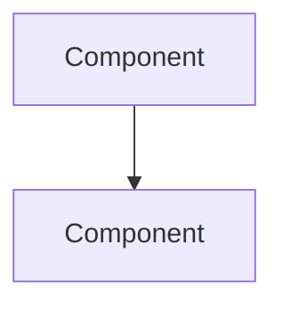

# PingLess Studios — VitePress Documentation Generator Prompt

Copy this entire prompt and give it to any AI agent (Claude, ChatGPT, etc.) along with your project repo URL. The AI will generate complete VitePress documentation matching the existing PingLess Studios docs style.

---

## YOUR TASK

Generate complete VitePress documentation for a PingLess Studios project and integrate it into the existing docs site at `https://github.com/AnAverageBeing/pingless-studios-docs`.

---

## STEP 1: UNDERSTAND THE PROJECT

First, explore the project repository to understand:
- What it does (one sentence)
- Key features (5-10 bullet points)
- How to install it (one-liner)
- CLI commands if any
- Configuration file format if any
- Architecture (major components)

---

## STEP 2: UNDERSTAND THE DOCS STRUCTURE

Clone the docs repo and study the existing structure:

```bash
git clone https://github.com/AnAverageBeing/pingless-studios-docs.git
```

Key files to read BEFORE writing anything:
- `docs/.vitepress/config.ts` — sidebar structure, nav, theme settings
- `docs/index.md` — homepage with hero and feature cards
- `docs/projects/index.md` — project listing page
- `docs/openshield-xdp/index.md` — example of a project overview page

**Critical**: The config.ts uses TypeScript object syntax. Every `{`, `}`, `[`, `]`, and `,` must be exactly correct.

---

## STEP 3: CREATE DOCUMENTATION PAGES

Create a directory: `docs/<project-slug>/`

### Required pages (minimum):

| File | Purpose |
|------|---------|
| `index.md` | Project overview with architecture diagram (mermaid), feature list, quick install one-liner, comparison table |
| `getting-started/installation.md` | Prerequisites, install steps, post-install verification, troubleshooting, uninstall |
| `configuration/reference.md` | **EVERY** config value documented: YAML path, type, default, what it does, when to change it, common mistakes |
| `user-guide/cli.md` | Every CLI command with syntax, example output, when to use |
| `architecture/overview.md` | System architecture diagram, component descriptions, data flow, threading model, file layout |

### Optional pages (add if applicable):

| File | When to add |
|------|------------|
| `user-guide/tui.md` | If project has a terminal UI |
| `user-guide/webhooks.md` | If project sends webhook/Discord notifications |
| `user-guide/api.md` | If project has a REST API |
| `architecture/<topic>.md` | Deep dives into specific subsystems |
| `getting-started/quick-start.md` | If there's a 30-second setup path |
| `getting-started/faq.md` | Common questions |

### Page template (every .md file):

```markdown
---
title: Page Title
description: Brief SEO description
---

# Page Title

Content here. Use proper markdown.

::: tip
Use VitePress callouts: `::: tip`, `::: warning`, `::: danger`, `::: info`
:::

## Section Header

Content...

### Mermaid Diagrams



### Code Blocks

```bash
command --flag
```

```yaml
config:
  key: value
```
```

---

## STEP 4: UPDATE THE SIDEBAR CONFIG

Edit `docs/.vitepress/config.ts`.

### MANDATORY RULES (I got these wrong — don't repeat my mistakes):

1. **SIDEBAR ENTRY MUST GO INSIDE `sidebar: [` NOT AFTER IT**
   - Find the `sidebar: [` array (around line 32)
   - Find its closing `  ],` (just before `socialLinks:`)
   - Insert your new entry BETWEEN existing entries and the closing `  ],`
   - **Wrong**: Inserting after `  ],` — this puts it outside the sidebar array
   - **Right**: Inserting before `  ],` — inside the array

2. **ALL SECTIONS MUST START COLLAPSED**
   - Set `collapsed: true` on EVERY section (not `false`)
   - The existing projects might have `collapsed: false` — match the NEW convention of `true`

3. **CORRECT JSON SYNTAX**
   - Every object needs commas between properties
   - Every array item needs commas between entries
   - The LAST item in an array does NOT have a trailing comma (TypeScript is stricter than JSON)
   - Indent with 2 spaces, not tabs

### Sidebar entry template:

```typescript
    {
      text: 'Project Name',
      collapsed: true,       // <-- ALWAYS true
      items: [
        {
          text: 'Getting Started',
          collapsed: true,   // <-- ALWAYS true
          items: [
            { text: 'Overview', link: '/project-slug/' },
            { text: 'Installation', link: '/project-slug/getting-started/installation' }
          ]
        },
        {
          text: 'Configuration',
          collapsed: true,
          items: [
            { text: 'Reference', link: '/project-slug/configuration/reference' }
          ]
        },
        {
          text: 'User Guide',
          collapsed: true,
          items: [
            { text: 'CLI Reference', link: '/project-slug/user-guide/cli' }
          ]
        },
        {
          text: 'Architecture',
          collapsed: true,
          items: [
            { text: 'Overview', link: '/project-slug/architecture/overview' }
          ]
        }
      ]
    },
```

### To insert correctly, use this Python approach (safe):

```python
with open('docs/.vitepress/config.ts', 'r') as f:
    lines = f.readlines()

# Find the closing of the sidebar array (before socialLinks)
insert_at = None
for i, line in enumerate(lines):
    if line.rstrip() == '  ],' and i+3 < len(lines) and 'socialLinks' in lines[i+3]:
        insert_at = i
        break

# Insert the new sidebar entry BEFORE the closing bracket
new_entry = '''    {
      text: 'YOUR PROJECT',
      collapsed: true,
      items: [ ... ]
    },
'''
lines.insert(insert_at, new_entry)

with open('docs/.vitepress/config.ts', 'w') as f:
    f.writelines(lines)
```

---

## STEP 5: UPDATE THE HOMEPAGE

Edit `docs/index.md`. Add a feature card under `features:`:

```yaml
  - icon:        # <-- LEAVE EMPTY (no emoji)
    title: Project Name
    details: One-sentence description of what it does.
    link: /project-slug/
```

**RULES:**
- `icon:` must be EMPTY (no emojis — we removed them)
- `link:` must start with `/` (VitePress relative path)
- Keep `details:` to one sentence

---

## STEP 6: UPDATE THE PROJECTS PAGE

Edit `docs/projects/index.md`. Add a section:

```markdown
## Project Name
One-paragraph description.

[Documentation →](/project-slug/) · [GitHub →](https://github.com/AnAverageBeing/repo-name)
```

---

## STEP 7: VERIFY BEFORE PUSHING

Run these checks before committing:

```bash
# 1. Sidebar entry is INSIDE the sidebar array
grep -n "project-slug" docs/.vitepress/config.ts
# Should appear BEFORE the line with "socialLinks", not after

# 2. All sections are collapsed
grep "collapsed: false" docs/.vitepress/config.ts
# Should return NOTHING (or only for sections you intentionally want open)

# 3. No emojis in feature cards
grep "icon:." docs/index.md | grep -v "icon: $" 
# Should return NOTHING

# 4. All links are valid
find docs/project-slug -name "*.md" -exec grep -oP 'link:\s*'\''[^'\'']*'\''"' {} \; | sort -u
# Every link path should match an actual .md file
```

---

## STEP 8: COMMIT AND PUSH

```bash
cd /path/to/pingless-studios-docs
git add -A
git commit -m "docs: add PROJECT NAME documentation"
git push origin main
```

---

## COMPLETE EXAMPLE: WHAT I DID FOR BANDWIDTH MANAGER

### Files created (8 files, 5,391 lines):
```
docs/bandwidth-manager/
├── index.md                          # Overview + architecture diagram
├── getting-started/
│   └── installation.md               # Install + troubleshoot
├── configuration/
│   └── reference.md                  # Every config value (2,384 lines)
├── user-guide/
│   ├── cli.md                        # All 24 commands
│   ├── tui.md                        # Keyboard shortcuts + layout
│   └── webhooks.md                   # Discord/Slack setup
└── architecture/
    ├── overview.md                   # System diagrams + DB schema
    └── tc-explained.md              # Kernel-level deep dive
```

### Changes to existing files:
- `docs/.vitepress/config.ts` — added sidebar entry + nav link
- `docs/index.md` — added feature card
- `docs/projects/index.md` — added project listing

---

## PITFALLS I HIT (Learn From These)

| Mistake | Symptom | Fix |
|---------|---------|-----|
| Sidebar entry after `socialLinks` | Doesn't appear in sidebar | Insert BEFORE `  ],` that closes `sidebar: [` |
| `collapsed: false` everywhere | Sidebar fully expanded, cluttered | Set ALL to `collapsed: true` |
| Emojis in `icon:` field | Ugly emojis on homepage cards | Leave `icon:` empty |
| Wrong indentation in config.ts | VitePress build fails | 2-space indent, no tabs |
| Missing trailing comma in sidebar entry | TypeScript compilation error | Every array item and object property needs commas |

---

## REFERENCE: VITEPRESS CALLOUT SYNTAX

```markdown
::: tip
This is a helpful tip.
:::

::: warning
This is a warning about something dangerous.
:::

::: danger
This will break things if done wrong.
:::

::: info
Additional context or background information.
:::

::: details Click to expand
Hidden content that's revealed on click.
:::
```

---

## REFERENCE: MERMAID DIAGRAM TYPES THAT WORK

```mermaid
graph TD        # Top-down flowchart
graph LR        # Left-right flowchart
sequenceDiagram # Timeline interactions
erDiagram       # Database entity relationships
mindmap         # Hierarchical mind map
flowchart TD    # Decision trees
```

---

## PROJECT-SPECIFIC INSTRUCTIONS

**[INSERT YOUR PROJECT NAME HERE]**

- Repository URL: `https://github.com/AnAverageBeing/[REPO-NAME]`
- Project slug for docs: `[project-slug]`
- Project description: [ONE SENTENCE]
- Key features: [BULLET LIST]
- Special sections needed: [e.g., API docs, benchmark results, security model]
